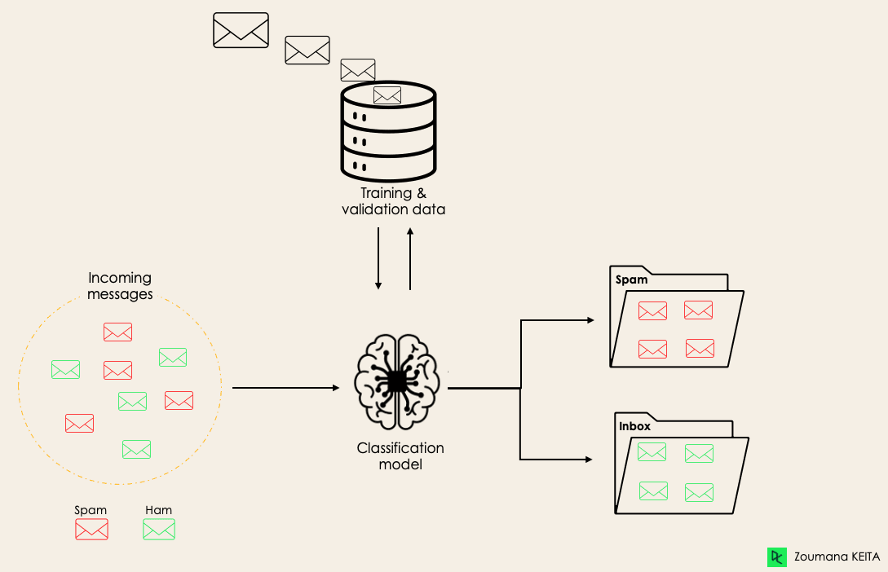
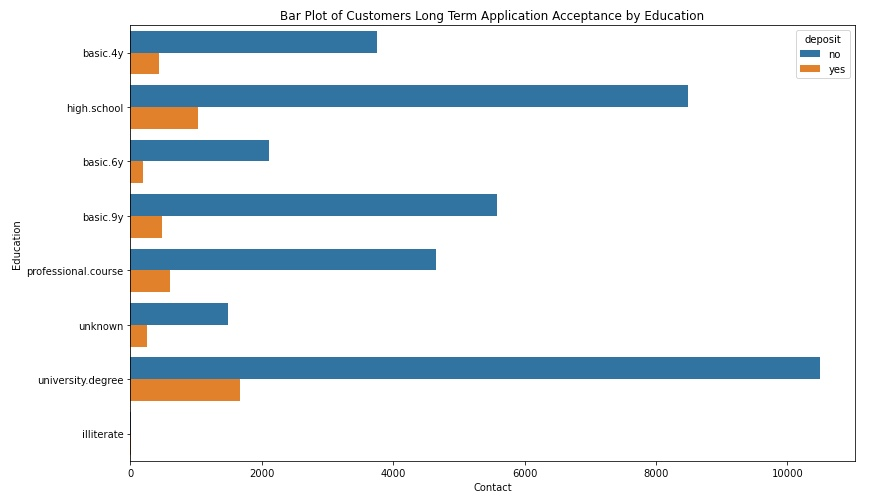
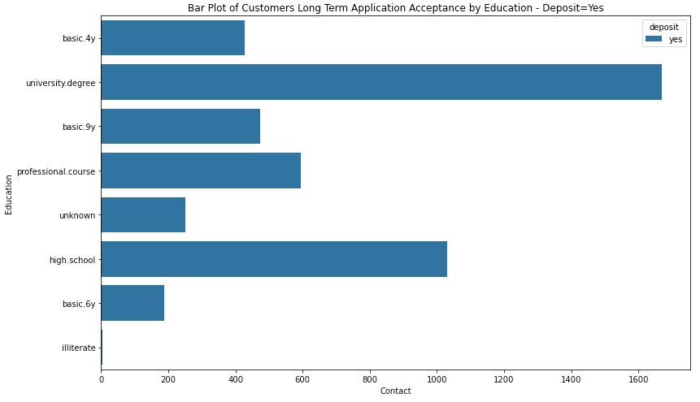
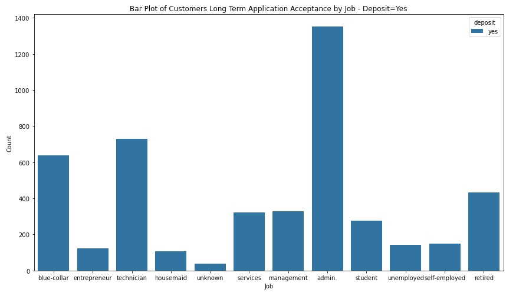
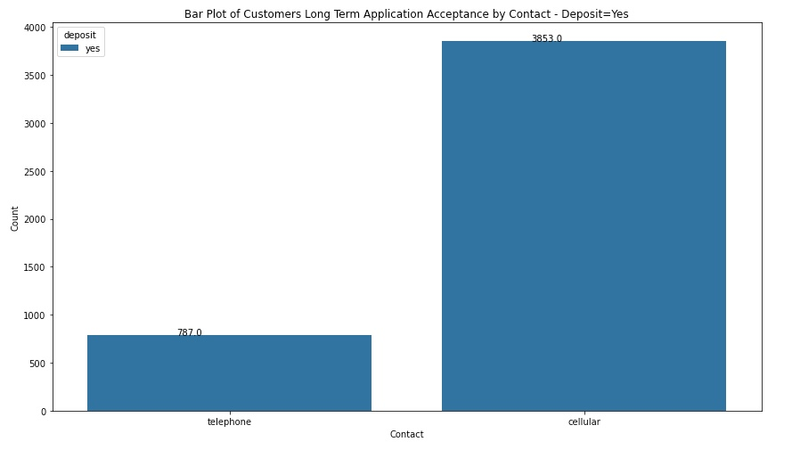

# comparingclassifiers
GitHub Repository for work done on Professional Certificate in Machine Learning and Artificial Intelligence - February 2022

# Practical Application Assignment 17.1: Comparing Classifiers

**Contents**

 * [Introduction](#Introduction)
 * [How to use the files in this repository?](#how-to-use-the-files-in-this-repository)
 * [Business Understanding](#Business-Understanding)
 * [Data Understanding](#Data-Understanding)
 * [Data Preparation](#Data-Preparation)
 * [Baseline Model Comparison](#Baseline-Model-Comparison)
 * [Model Comparisons](#Model-Comparisons)
 * [Improving the Model](#Improving-the-Model)
 * [Findings](#Findings)
 * [Next steps and Recommendations](#Next-steps-and-Recommendations)
 * [License](#license)
 
## Introduction

This repository contains the Jupyter Notebook for the Application Assignment 17.1. This takes a sample jupyter notebook to complete the exercise to analyse UCI Bank Marketing Data Set in [bank-additional.csv](https://github.com/yemifalokun/comparingclassifiers/blob/main/data/bank-additional.csv) file in the data folder of this repository to build a machine learning application that uses classifications to evaluate customers that will accept the Long-term deposit application using features like job, marital status, education, housing and personal loan.

The goal of this project is to compare the performance of the following classifiers namely 
* K Nearest Neighbor
* Logistic Regression
* Decision Trees and 
* Support Vector Machines

In comparing the models, the training times and accuracy of the models will be recorded. This should provide an indication on the model that will provide predictions to determine which customer will accept the long term deposit bank product via a phone based marketing campaign.

## How to use the files in this repository?

The notebooks are grouped into the following categories:
 * ``articles`` – More information on the data and features
 * ``data`` – vehicles.csv data file from Kaggle Machine Learning dataset repository used in the notebooks
 * ``images`` – Image files used in Notebook and Project Description
 * ``notebook`` – What Drives the Price of a Car Notebook

## Business Understanding

The business objective is to identify key features for used car prices based on the dataset provided so that Car Dealers and their Sales Team can use these key features to understand the cars that they need to have in their inventory to increase sales.

For this application, we are using classfication in Machine Learning as we are comparing classsifiers. Classification is a supervised machine learning method where the model tries to predict the correct label of a given input data. In classification, the model is fully trained using the training data, and then it is evaluated on test data before being used to perform prediction on new unseen data.

Diagram above shows an example of a classification use case where the algorithms can learn to predict whether a given email is spam or not.

Source - https://www.datacamp.com/blog/classification-machine-learning

### Business Objective Definition

This dataset was provided for a Portugese banking institution and is a collection of the results of multiple marketing campaigns.  The analysis of the data shows that the marketing campaign was not very successful in getting customers to sign up for the long term deposit product.

From a business objective, the task of this Machine Learning project is to determine which factors could lead to a higher success rate, for example,
- How does loan products have a positive impact on customer success rate?, for example, do we concentrate on customers with Housing loan?
- Are we going to have a better success rate with customers with “university degree”?
- How does the contact method (i.e., cellular) affect whether the success rate for long term loan products?

## Data Understanding

Examining the data, it does not have missing values in the columns/features. Reviewing the features of the datasets like job, marital status, education, housing and personal loans to check if this has an impact on the customers where the marketing campaign was successful. 

Displayed below are some charts providing visualization on some of the observations of the dataset.

The first thing that was apparent from the provided data was that the low success rate of the marketing campaign in getting customers to sign up for the long term deposit product regardless of the features recorded for the customers (i.e., Education, Marital Status, job, contact etc.).

The one slight exception are customers with housing loan types where 52.4% signed up for the long term deposit product vs. 45.2% who did not.

An Alternative view on the data is to review number of succesful campaigns to see how features like education and job had a positive impact on the number of successful campaigns. See plots below:

     

          
     

     

          
     

Reviewing the plots where the customer signed up for the Bank Product/Marketing campaign was successful, you can observe the following:

- On Education, university degree folks said yes to the bank loan product
- For Job, bank had the most success with folks in admin role which is very broad, followed by Technician, then blue-collar

## Data Preparation

Apart from the imbalanced nature of the dataset, the following was done to prepare the dataset for modeling:
- Renamed "Y" feature to "deposit" to make it more meaningful
- Use features 1 - 7 (i.e., job, marital, education, default, housing, loan and contact ) to create a feature set
- Use ColumnTransformer to selectively apply data preparation transforms, it allows you to apply a specific transform or sequence of transforms to just the numerical columns, and a separate sequence of transforms to just the categorical columns
- Use LabelEncoder to encode labels of the target column
- With your data prepared, split it into a train and test set. Next, we will split the data into a training set and a test set using the train_test_split function. We will use 30% of the data as the test set

## Baseline Model Comparison

For the baseline model, decided to use a DecisionTreeClassifer which is a class capable of performing multi-class classification on a dataset. This Classifier has the ability to using different feature subsets and decision rules at different stages of classification.

This model will be compared with Logistic Regression model which is used to describe data and the relationship between one dependent variable and one or more independent variables.

Logistic Regression Machine Learning is quite fascinating and accomplishes some things far better than a Decision Tree when you possess a lot of time and knowledge. A Decision Tree's second restriction is that it is quite costly in terms of the sample size.

In training, fitting and predicting both models on the dataset, the following results were observed:

| Model Name  	        | Accuracy                              | Precision	                    | Recall 	                | F1_Score                  | Fit Time (ms) 
|-------------	        |:------------------------------------	|:-------------------------:	|:----------------------:	|:----------------------:	|:----------------------:	|
| Decision Tree       	| 0.887513                              | 0.443792                  	| 0.499954                  |  0.470202                 | 128                       |
| Logistic Regression   | 0.887594                              | 0.443797                     	| 0.500000                  |  0.470225                 | 193                       |
|             	        |                                      	|                           	|                        	|                           |                           |

Quick review of this results show that accuracy scores were very close with numbers over 85%, however the recall, precision and F1_Score were below 50%.

This means the classifier has a high number of False negatives which can be an outcome of imbalanced class or untuned model hyperparameters. More likely because of the imbalanced dataset with a higher number of Deposit = "No" records.

## Model Comparisons

In this section, we will compare the performance of the Logistic Regression model to our KNN algorithm, Decision Tree, and SVM models. Using the default settings for each of the models, fit and score each. Also, be sure to compare the fit time of each of the models.

| Model Name        	| Train Time (s)                      | Train Accuracy                | Test Accuracy 	                | 
|-------------------	|:---------------------------	|:---------------------:	|:----------------------:	|
| Logistic Regression   | 0.322                         | 0.8872047448926502        | 0.8875940762320952                 |  
| KNN                   | 55.8                          | 0.8846033783080711        | 0.8807963097839281                  |  
| Decision Tree	        | 0.376                         | 0.8911935069890049        | 0.884761673545359                 |  
| SVM                   | 24.4                          | 0.8873087995560335        | 0.8875131504410455                 |  
|                       |                               |                           |                        	| 

Looking at the results from the model comparison, Logistic Regression had the best numbers across the three metrics with lowest train time in seconds, highest training and testing accuracy scores.

## Improving the Model

This dataset is so imbalanced when you look at the Exploratory section of this Notebook, using the features to see if we can get a higher percentage of successful sign up for long term product did not provide a positive result with the exception of customer that have housing loan with a number of 52.4%

Using Grid Search to create models with the different parameters and evaluate the performance metrics

| Model Name        	| Train Time (s)                      | Best Parameters                                          | Best Score 	                | 
|-------------------	|:---------------------------	|:-------------------------------------------------:	         |:----------------------:	|
| Logistic Regression   | 64                            | C:0.001, penalty:l2, solver: liblinear	                     | 0.8872394393842521                |  
| KNN                   | 302                           | n_neighbors: 17                                                | 0.8855397848500199                 |  
| Decision Tree         | 15.7                          | criterion: entropy, max_depth: 1, model__min_samples_leaf: 1   | 0.8872394393842521                  |  
| Logistic Regression   | 490                           | C: 0.1, kernel: rbf                                            | 0.8872394393842521                 |  
|                       |                               |                                                                |                        	| 

For SVM, I tried a number of paramaters which took a long time (i.e., some running over 2 hours etc) and did not finish because I had to abort the processing. Finally got the following parameter to work which took over 8 minutes as shown above.

 - param_grid_svc2 = { 'model__C': [ 0.1, 0.5, 1.0 ], 'model__kernel': ['rbf','linear'] }

Interesting observation in that Logistic Regression, Decision Tree and Support Vector Machines had the same best score with their different best parameters. This leaves KNN with the lowest best score. All scores were high over 85% accuracy.

## Next Steps and Recommendations

The main question that I have is the imbalanced dataset which is heavily weighted towards the unsuccessful marketing campaigns. If the model is used to determine features that are making the marketing campaign unsuccessful, then the models above could be useful.

Alternatively, the model can be used by the financial institution to understand customer profile that they need to target, for example, there was a high score amongst the "Yes" for customers contacted via Cellular so maybe the Bank can adopt modern features like Text Messages, Social Media platforms (i.e. Facebook, Instagram, Twitter, Tik Tok etc) for marketing campaigns

## License

Open source projects are made available and contributed to under licenses that include terms that, for the protection of contributors, make clear that the projects are offered “as-is”, without warranty, and disclaiming liability for damages resulting from using the projects.
